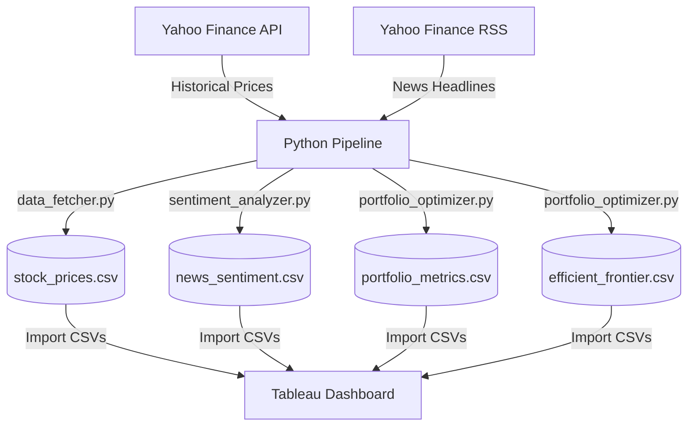

# Stock Portfolio Optimizer & Sentiment Tracker

A dynamic, data-driven application that blends Modern Portfolio Theory (MPT) and News Sentiment Analysis using a Python data pipeline and Tableau interactive dashboards.

## System Architecture



---

## Getting Started

### 1. Prerequisites
Make sure you have Python 3.8+ installed on your system.

### 2. Installation
Install the necessary python dependencies:
```bash
pip install -r requirements.txt
```

### 3. Running the Pipeline
Run the orchestrator script to fetch the latest stock data, news sentiment, and generate portfolio optimization configurations:
```bash
python run_pipeline.py
```
This script dynamically calculates dates for the past 2 years and outputs four files into the `data/` directory:
- `data/stock_prices.csv`: Adjusted closing prices and daily return rates.
- `data/news_sentiment.csv`: News headlines, links, publication times, and VADER sentiment scores.
- `data/portfolio_metrics.csv`: Optimal asset weights and portfolio stats for Max Sharpe, Min Volatility, and Individual Benchmarks.
- `data/efficient_frontier.csv`: Volatility, Return, and Sharpe ratios for 2,000 simulated random portfolios.

---

## Tableau Dashboard Implementation Guide

Follow these steps to build an interactive, premium-grade dashboard.

### STEP 1: Connect Your Data Sources
1. Open **Tableau**.
2. Under **Connect**, click **Text File** and select `stock_prices.csv` from the `data/` folder.
3. In the canvas area, drag `portfolio_metrics.csv` and `news_sentiment.csv` next to `stock_prices.csv`.
   * Tableau will automatically create logical relationships (represented by "noodles") linking them via the **`Ticker`** field.
4. Go to the top menu, select **Data** ➔ **New Data Source**, choose **Text File**, and load `efficient_frontier.csv` as a separate standalone table.

### STEP 2: Designing the Sheets

#### Sheet 1: Efficient Frontier (Scatter Plot)
* **Data Source:** Select `efficient_frontier`.
* **Setup:**
  1. Drag `Volatility` to **Columns**.
  2. Drag `Expected Return` to **Rows**.
  3. Go to the top menu bar, click **Analysis**, and **uncheck** **Aggregate Measures**.
  4. Drag `Simulated Portfolio ID` to **Detail** on the Marks card.
  5. Drag `Sharpe Ratio` to **Color** on the Marks card.
  6. Edit colors and choose a diverging gradient (e.g., *Red-Blue Diverging* or *Orange-Blue Diverging*).

#### Sheet 2: Optimal Asset Allocations (Donut/Bar Chart)
* **Data Source:** Select `portfolio_metrics`.
* **Setup:**
  1. Drag `Ticker` to **Columns**.
  2. Drag `Weight` to **Rows** (set aggregation to `SUM`).
  3. Drag `Portfolio Type` to the **Filters** card. 
     * Right-click `Portfolio Type` in filters and select **Show Filter**.
     * Change the filter type to **Single Value (List)**.

#### Sheet 3: News Sentiment Distribution
* **Data Source:** Select `news_sentiment`.
* **Setup:**
  1. Drag `Ticker` to **Rows**.
  2. Drag `Sentiment Label` to **Columns**.
  3. Drag `news_sentiment.csv (Count)` to **Columns** next to `Sentiment Label`.
  4. Drag `Sentiment Label` to **Color** in the Marks card.
     * Map colors: `Positive` = Green, `Neutral` = Gray, `Negative` = Red.

### STEP 3: Assemble the Dashboard
1. Click the **New Dashboard** icon at the bottom.
2. In the left panel under Dashboard, change the **Size** to **Automatic** so it resizes nicely.
3. Drag **Sheet 1 (Efficient Frontier)** and **Sheet 2 (Asset Allocations)** side-by-side at the top.
4. Drag **Sheet 3 (Sentiment)** to the bottom.
5. Select the Sentiment chart, and click the **Use as Filter** funnel icon in its top-right panel to enable cross-chart filtering.
